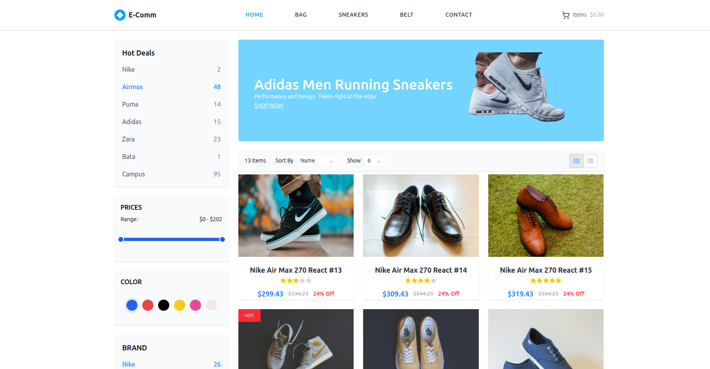

# Product Listing Page (React + Vite + Tailwind CSS)

<p align="center">
	
</p>

A modern, responsive e-commerce product listing page built with React, Vite, and Tailwind CSS. Features include a responsive navbar, collapsible sidebar with filters, product grid, pagination, and a clean, mobile-friendly design.

## Features
- Responsive navigation bar with mobile hamburger menu
- Collapsible sidebar with filters (hot deals, price range, color, brand)
- Sidebar overlays content on mobile and is always visible on desktop
- Product grid with dummy data and ratings
- Pagination
- Footer with contact info and payment cards
- Built with React, Vite, and Tailwind CSS

## Getting Started

### Prerequisites
- Node.js (v18 or newer recommended)
- npm (comes with Node.js)

### Installation
1. **Clone the repository**
	```bash
	git clone <your-repo-url>
	cd Product\ Listing\ Page/Frontend
	```
2. **Install dependencies**
	```bash
	npm install
	```

### Development
To start the development server with hot reload:
```bash
npm run dev
```
Visit [http://localhost:5173](http://localhost:5173) in your browser.

### Build for Production
To build the app for production:
```bash
npm run build
```
The output will be in the `dist/` folder.

### Preview Production Build
To locally preview the production build:
```bash
npm run preview
```

## Project Structure
```
Frontend/
├── public/                # Static assets (images, etc.)
├── src/
│   ├── components/        # Reusable UI components (Navbar, Sidebar, etc.)
│   ├── pages/             # Page-level components (Sidebar, Content)
│   ├── App.jsx            # Main app component
│   ├── main.jsx           # Entry point
│   └── index.css          # Tailwind CSS import
├── package.json           # Project metadata and scripts
├── vite.config.js         # Vite configuration
└── README.md              # Project documentation
```

## Customization
- Update product data in `src/components/ProductGrid.jsx`.
- Adjust navigation links in `src/components/Navbar.jsx`.
- Modify sidebar filters in `src/pages/Sidebar.jsx` and related components.

## Dependencies
- [React](https://react.dev/)
- [Vite](https://vitejs.dev/)
- [Tailwind CSS](https://tailwindcss.com/)
- [Lucide React](https://lucide.dev/)
- [React Icons](https://react-icons.github.io/react-icons/)
- [@mui/material](https://mui.com/) (for toolbar toggle)
- [react-range](https://github.com/tajo/react-range) (for price slider)

## License
This project is for educational/demo purposes. You may use and modify it as you wish.

---
Feel free to reach out if you have questions or suggestions!
